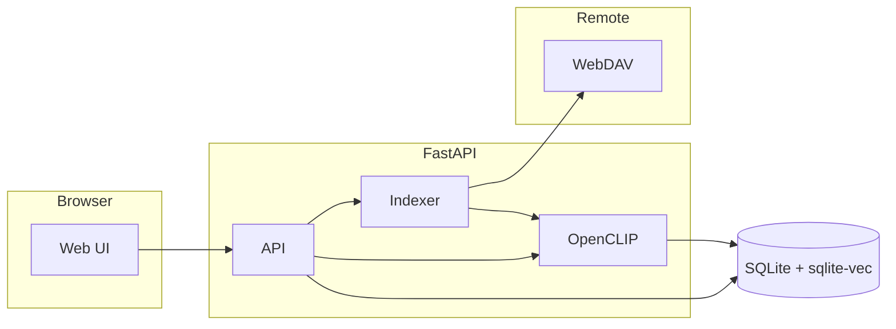

<div align="center">


# Nimbus — **pCloud** semantic search (WebDAV + CLIP)

### Natural-language search for **pCloud** photos and any WebDAV library

**Self-hosted · pCloud WebDAV · OpenCLIP · sqlite-vec** — originals stay in the cloud; only vectors and paths live in SQLite on your machine.

[](https://www.python.org/)
[](https://fastapi.tiangolo.com/)
[](https://www.docker.com/)
[](LICENSE)

</div>

---

## Why “Nimbus”?

The **product name** is **Nimbus** — short and memorable. This README still mentions **pCloud**, **semantic search**, **CLIP**, and **WebDAV** so people can find the project on GitHub; that is **not** the app name. **This project is not affiliated with pCloud AG** (see disclaimer below).

---

## What it does

**Nimbus** connects to **pCloud (or any WebDAV server)**, walks your folders, downloads each image **only in memory**, computes **512-dimensional OpenCLIP embeddings** (ViT-B-32, OpenAI weights), and stores **paths + vectors** in **SQLite** with **sqlite-vec**. You type a description; the app returns the closest matches and **streams thumbnails and full images** through a small proxy — nothing is written to disk except the database.

> **Disclaimer:** This is an independent open-source project. It is **not affiliated with, endorsed by, or sponsored by pCloud AG**.

## Features

- **Semantic search** — scenes, objects, moods, lighting, style.
- **Resumable indexing** — skips already-indexed paths; safe to stop and restart. **Indexing runs on the server** — you can close the browser while it runs.
- **Optional scheduled index** — e.g. once a day via `NIMBUS_AUTO_INDEX_INTERVAL_HOURS` (see environment variables).
- **HEIC / JPEG / PNG / WebP** — in-memory decode; HEIC via `pillow-heif`.
- **Self-hosted** — one Docker service; persist only `./data` (SQLite).
- **Web UI** — light/dark theme, suggested searches, recent queries, no build step.
- **PWA** — install from the browser; offline shell only (search and photos still need the server).

## Architecture



## Quick start (Docker)

1. **Clone** this repository.

2. **Configure** environment:

   ```bash
   cp .env.example .env
   ```

   Set `PCLOUD_USERNAME`, `PCLOUD_PASSWORD`, and `PCLOUD_WEBDAV_URL` to match your **pCloud region** (see table below).

3. **Run**:

   ```bash
   docker compose up --build
   ```

4. Open **http://localhost:8000**, run **Index photos** when credentials are valid, then search.

The database is persisted at `./data/photos.db` on the host.

## Progressive Web App (PWA)

The UI includes a **web app manifest** and a **service worker** (`/sw.js`) so you can **install** Nimbus on desktop or mobile (Chrome, Edge, Safari, and others).

- **Install:** Use **Install app** / **Add to Home Screen** while visiting the site. Browsers require **HTTPS** or **`localhost`** for install and for the service worker.
- **Offline:** The service worker caches the **shell** (HTML and static assets). **Search**, **indexing**, and **images** still need the **Nimbus server** running and access to **WebDAV**.
- **Updates:** After changing the frontend, rebuild so the container picks up new files: `docker compose up --build`.
- **Icons:** **`frontend/assets/icons/icon-192.png`** and **`icon-512.png`** match the branding in **`frontend/assets/logo.svg`** (replace or re-export those PNGs if you change the logo).

## Local development

Requires Python 3.11+.

```bash
python3 -m venv .venv
source .venv/bin/activate
pip install torch torchvision --index-url https://download.pytorch.org/whl/cpu
pip install -r backend/requirements.txt
cp .env.example .env   # edit credentials
cd backend && uvicorn main:app --reload --host 0.0.0.0 --port 8000
```

## Environment variables

| Variable | Description |
|----------|-------------|
| `PCLOUD_WEBDAV_URL` | **pCloud WebDAV host** (no path): **EU** → `https://ewebdav.pcloud.com` · **non-EU** (e.g. US) → `https://webdav.pcloud.com`. Other WebDAV servers use their own base URL. |
| `PCLOUD_USERNAME` | Account email (or user for your WebDAV server). |
| `PCLOUD_PASSWORD` | Password or app token. |
| `DB_PATH` | SQLite file path (Docker default: `/app/data/photos.db`). |
| `TAG_SIMILARITY_THRESHOLD` | Optional. Cosine similarity threshold (default `0.27`) for library tag counts (see below). |
| `NIMBUS_AUTH_USER` | Optional. If set **together with** `NIMBUS_AUTH_PASSWORD`, enables **HTTP Basic Auth** on the whole app (see **Security**). |
| `NIMBUS_AUTH_PASSWORD` | Optional. Password for Basic Auth (use a long random value on a VPS). |
| `NIMBUS_AUTO_INDEX_INTERVAL_HOURS` | Optional. If set (e.g. `24`), the server **automatically** starts an index crawl on that interval (UTC). **Requires** Docker/process to stay running. First run is delayed by `NIMBUS_AUTO_INDEX_FIRST_DELAY_MINUTES`. |
| `NIMBUS_AUTO_INDEX_FIRST_DELAY_MINUTES` | Optional. Minutes after startup before the **first** `NIMBUS_AUTO_INDEX_INTERVAL_HOURS` run (default `5`). |

### Library tags (not EXIF)

There are **no embedded keywords** in your files. After indexing, Nimbus compares every stored image embedding against a **fixed list of English concept prompts** (beach, portrait, food, …) using CLIP. For each concept, it counts how many photos exceed a similarity threshold. That produces the **“Common in your library”** chips on the home page — useful, but **approximate** (not the same as manual tags).

Stats refresh automatically after an index run, or via **Refresh tag stats** / `POST /tags/recompute`.

## Security (VPS / public internet)

By default the app **has no login**: anyone who can reach the port can use the UI and API. On a **VPS**, put Nimbus **behind a firewall** (only your IP or a VPN), terminate **HTTPS** in front (Caddy, nginx, Traefik), and/or enable **app-level auth**:

Set **`NIMBUS_AUTH_USER`** and **`NIMBUS_AUTH_PASSWORD`** in `.env`. The server then requires **HTTP Basic Authentication** for the UI and API. **`/assets/manifest.webmanifest`**, **`/sw.js`**, and the **PWA icon PNGs** are exempt so browsers can load the manifest and service worker (they often omit `Authorization` on those requests). Everything else stays protected.

Use a **strong password**; Basic Auth sends credentials **Base64-encoded** (not encryption) — **HTTPS is strongly recommended** on public networks. For stricter setups (OAuth, SSO), put a reverse proxy or identity provider in front instead.

## API (short)

| Method | Path | Purpose |
|--------|------|---------|
| `GET` | `/` | Web UI |
| `GET` | `/health` | Liveness + `version`, `indexed` count, `database` status |
| `POST` | `/index` | Start background indexing |
| `GET` | `/index/status` | Indexing progress and DB counts |
| `GET` | `/search?q=…` | JSON search results |
| `GET` | `/tags/popular` | Top library concepts `{ tags: [{ tag, count, suggest }] }` |
| `POST` | `/tags/recompute` | Rebuild tag counts (background job) |
| `GET` | `/photo?path=…&thumb=true` | Proxy image or thumbnail |
| `GET` | `/sw.js` | Service worker (PWA) |
| `GET` | `/assets/manifest.webmanifest` | Web app manifest (PWA) |

## Project layout

```
├── backend/           # FastAPI app, indexer, CLIP, DB helpers
├── frontend/          # Single-page UI, logos, PWA (manifest, sw.js, icons)
├── data/              # SQLite DB (Docker volume / local)
├── docker-compose.yml
├── .env.example
└── README.md
```

## Troubleshooting

| Symptom | What to try |
|--------|--------------|
| WebDAV / auth errors when indexing | Confirm **EU** vs **non-EU** URL (`ewebdav` vs `webdav`) in `.env`. Check username/password; use an app password if pCloud requires it. |
| Search returns nothing | Run **Index photos** first; wait until the indexed count is above zero. Try broader queries. |
| `database` is `error` in `/health` | Check `DB_PATH` is writable (Docker: `./data` mounted). Inspect logs: `docker compose logs`. |
| Thumbnails slow or fail | Large originals are downloaded each time; first load is slower. HEIC needs `pillow-heif` (included in Docker). |
| Container exits or restarts | First boot downloads the CLIP model (~minutes). `HEALTHCHECK` allows **120s** startup; see Docker logs. |
| `401 Unauthorized` everywhere | If you set `NIMBUS_AUTH_*`, use the same username/password in the browser prompt. Ensure `.env` is loaded by Compose. |

## Acknowledgments

- [OpenCLIP](https://github.com/mlfoundations/open_clip) — image and text encoders.
- [sqlite-vec](https://github.com/asg017/sqlite-vec) — vector search in SQLite.
- [webdav4](https://github.com/skshetry/webdav4) — WebDAV client.

## License

This project is released under the [MIT License](LICENSE).
